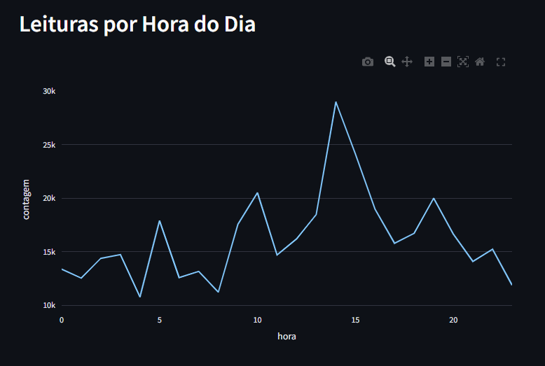

# Dashboard de Temperaturas Iot 

Este projeto criar um dashboard interativo para monitoramento de temperaturas utilizando dados
de sensores Iot . O dashboard é desevolvimento em Python, utilizando as bibliotecas Streamlit,
Pandas e SQLAlchemy, e os dados são armazenados em um banco de dados PostgreSQL.

## Configuração 

### Pré-requisitos

- Docker
- Python 3.8+
- PostgreSQL
- Bibliotecas Python: pandas, plotly, sqlalchemy, streamlit, psycopg2

### Instalação

1. Clone o repositório do projeto:
  ```sh
git clone https://github.com/FabioHenriquefbi/dashboard_temperaturas_iot

docker run --name postgres-iot -e POSTGRES_PASSWORD=1234 -d postgres

pip install pandas plotly sqlalchemy streamlit psycopg2

docker exec -it postgres-iot psql -u postgres
CREATE DATABASE tempo;
\c tempo 

python ler_csv.py

### 3. Execução do projeto 

```markdown

## Execução

1. Execute o dashboard com Streamlit:
  ```sh
  streamlit run dashboard.py

#### 4.Capturas de Tela do Dashboard

```markdown
## Capturas de Tela 

Inclua aqui as capturas de tela do seu dashboard. Você pode fazer isso com a sintaxe Markdown:





## Views SQL

### View 1: Temperaturas Internas
```sql
CREATE VIEW temp_interna AS 
SELECT "room_id/id", noted_date, temp
FROM tabela_tempo
WHERE "out/in" = 'In';

CREATE VIEW temp_externa AS 
SELECT "room_id/id", noted_date, temp
FROM tabela_tempo
WHERE "out/in" = 'Out';

CREATE VIEW media_temp_sala AS
SELECT "room_id/id", AVG(temp) AS media_temp
FROM tabela_tempo
GROUP BY "room_id/id";

CREATE VIEW leituras_por_hora AS 
SELECT DATE_PART('hour', noted_date) AS hora, COUNT(*) AS contagem
FROM tabela_tempo
GROUP BY DATE_PART('hour', noted_date)
ORDER BY hora;

CREATE VIEW temp_max_min_por_dia AS
SELECT DATE(noted_date) AS data, MAX(temp) AS temp_max, MIN(temp) AS temp_min
FROM tabela_tempo
GROUP BY DATE(noted_date)
ORDER BY data;

#### 6. Possíveis Insights Obtidos dos Dados

```markdown
## Insights dos Dados

A partir das análises realizadas no dashboard, alguns insights interessantes podem ser 
obtidos:

- Média de Temperatura por Sala:A média de temperatura por sala pode indicar ambientes que necessitam de melhor controle climático.
- Picos de leituras por Hora:A análise das laeituras por hora pode ajudar a identificar
horários de maior atividade e demanda no monitoramento de temperatura.
- Temperaturas Extremas:** As temperaturas máximas e mínimas por dia podem indicar eventos
climáticos extremos ou falhas nos dispositivos de monitoramento.

Esses insights podem ser utilizados para otimizar o ambiente e garantir condições ideais de 
temperatura, tanto internas quanto externas.

